# Google Auth demo con Passport.js y jsonwebtoken

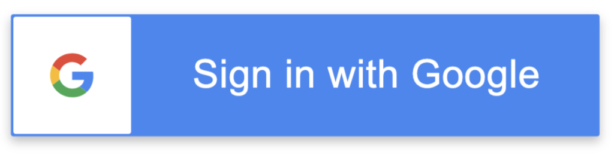

Demostración de autenticación con Google hecha en Node.js con express, passport.js y almacenando un jsonwebtoken(jwt) en las cookies. Cuenta con login y logout.

## Dependencias

- Dotenv
- Express
- Express-session
- Jsonwebtoken
- Passport
- Passport-google-oauth20
- Nodemon

## Instalación
```javascript
npm i 
npm i --save-dev nodemon
```

Para iniciar el proyecto en localhost:3000 debemos modificar scripts de package.json
```javascript
  "scripts": {
    "start": "nodemon index.js"
  },
```
Y después iniciar
```javascript
  npm start
```
## Contenido del archivo .env

Primero creamos el .env que luego añadiremos a .gitignore
```javascript
  CLIENT_ID
  CLIENT_SECRET
```


## Pasos en la cuenta de Google

Ahora que ya tenemos el proyecto listo para ser lanzado, antes debemos crear unas credenciales de Google. Para ello,
escribiremos en google: google credentials:

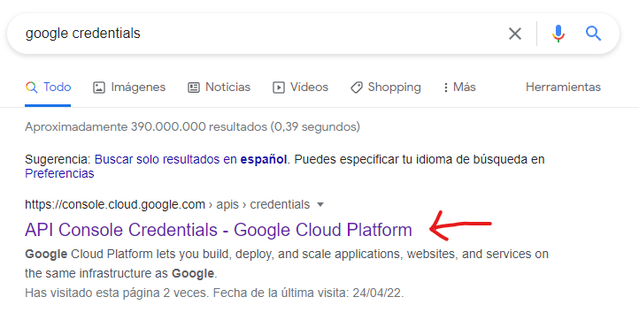

Nos dirigimos a este enlace. Una vez dentro nos aparecerá una opción de crear proyecto, lo creamos y le ponemos el nombre que queramos.


### El siguiente paso es crear un ID de cliente OAuth, para ello iremos aquí:

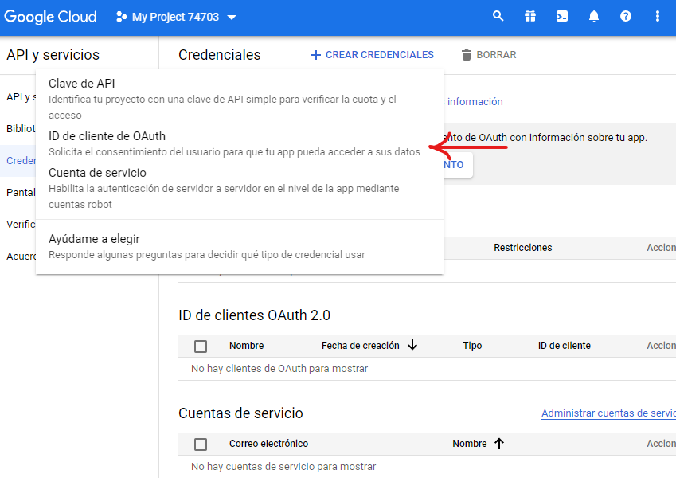

Nos aparecerá un mensaje de configurar pantalla de consentimiento, vamos a él.


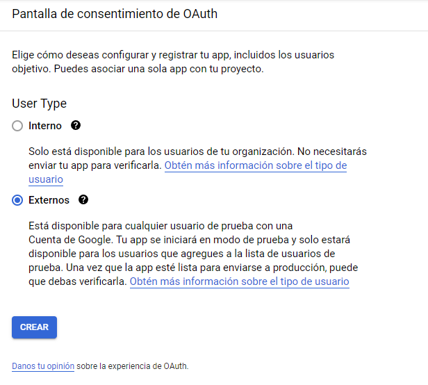

Elegimos externo


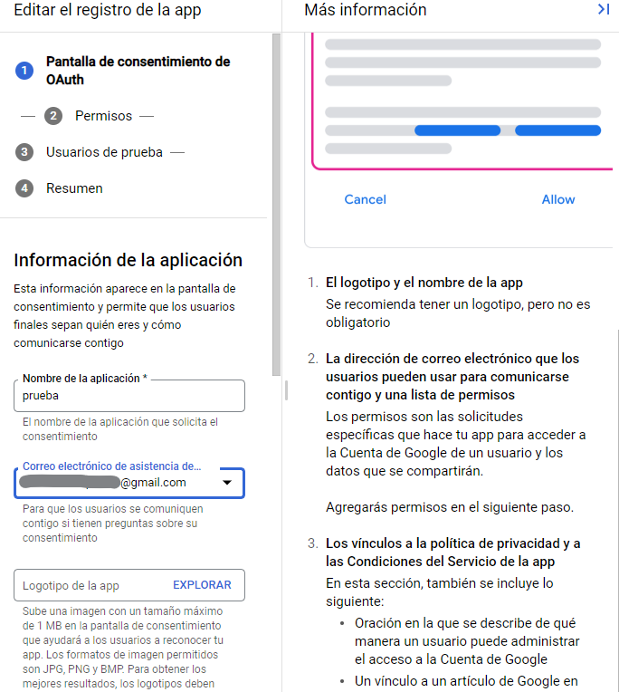

Aquí solo necesitamos marcar los campos obligatorios


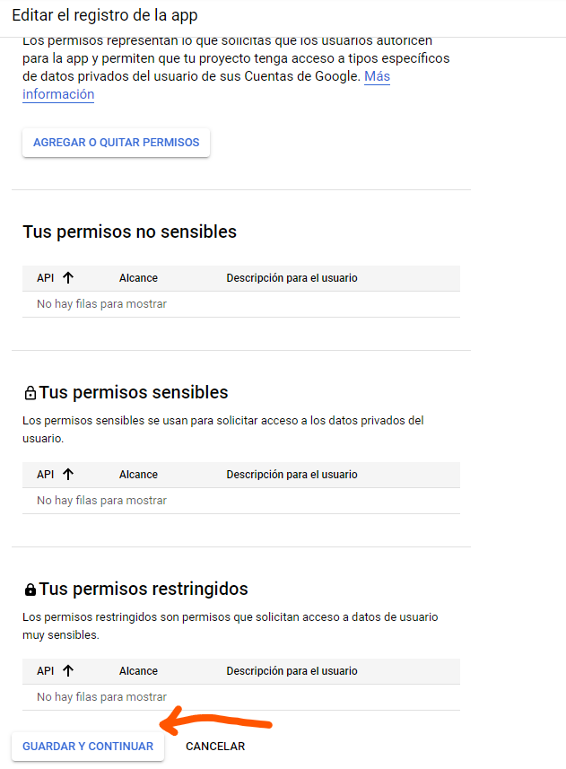

Vamos a guardar y continuar

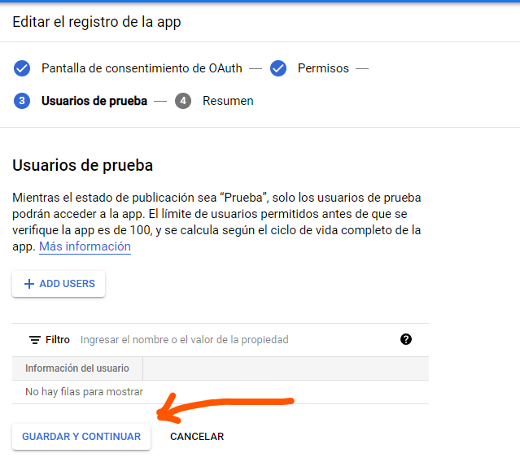

Guardar y continuar

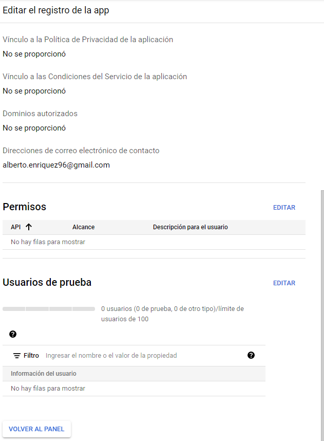

Volvemos al panel y con esto ya tenemos configurado la pantalla de consentimiento.

Ahora sí, vamos a credenciales y pulsamos de nuevo en Crear ID de cliente de OAuth. Escogemos aplicación web, y aquí llegan los pasos más importantes:

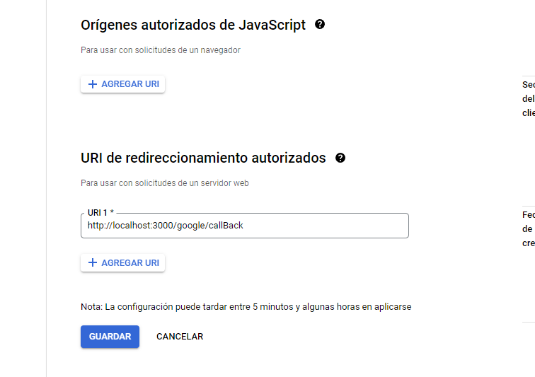

Debemos poner en URI de redireccionamiento autorizado, nuestra ruta 
```javascript
/google/callBack
```
Como vamos a correr la app en localhost:3000, simplemente concatenamos la url. En el caso de desplegar la app con otro dominio, hacer lo mismo.


Pulsamos en guardar y nos aparecerán nuestro ID de cliente y secreto de Cliente. Debemos guardarlos y escribirlos en el archivo .env definido anteriormente

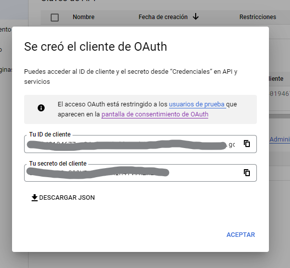


### Esto es todo por la parte de la cuenta de Google 

Una vez añadidas las credenciales a nuestro .env, el proyecto debería funcionar tal que así:

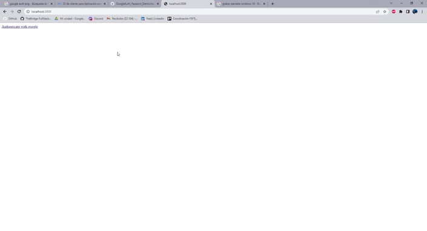


Como vemos, la autenticación de google nos crea un jsonwebtoken en las cookies que podemos tratar para manejar sesiones. Este token desaparece al hacer logout.


#### Este sería el funcionamiento del proyecto con autenticación de google. Las funciones están detalladas en el código con comentarios.